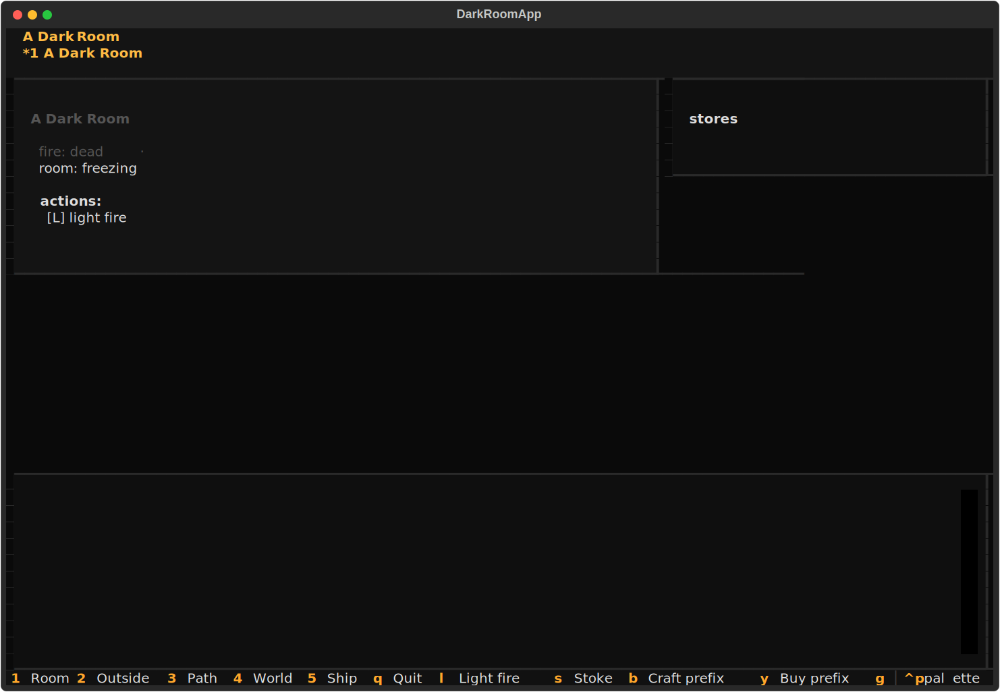
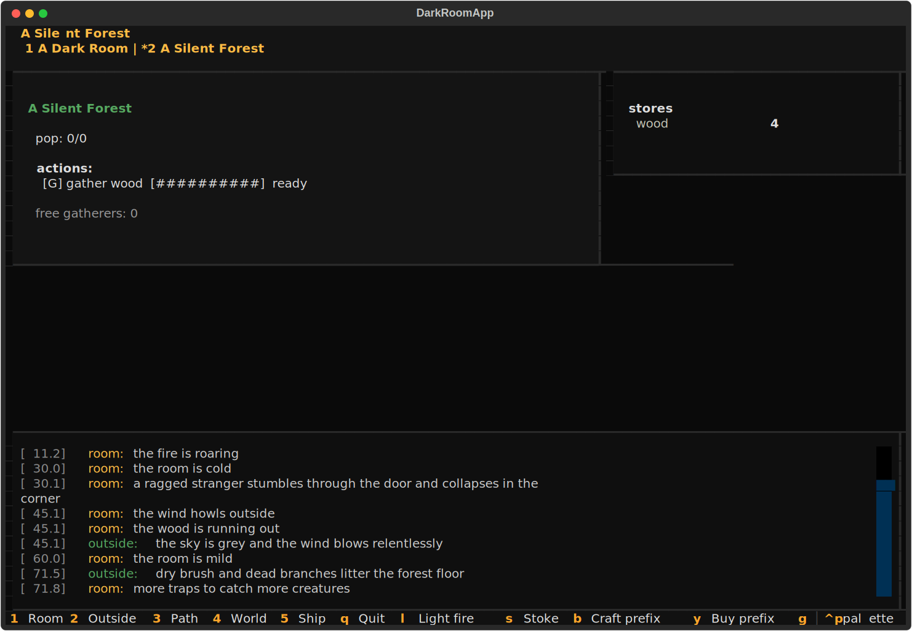
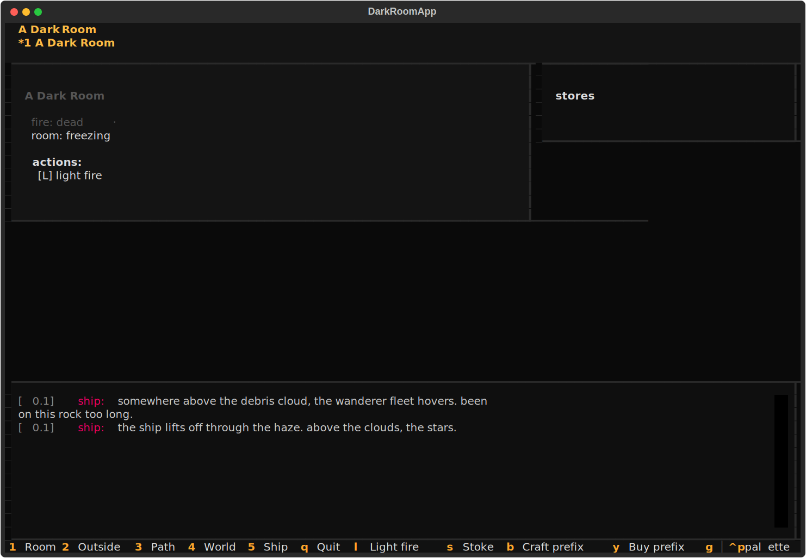

# dark-room-tui
The fire is lit. The story begins.





## About
The fire is dying. Stoke it. Build a hut. Gather the survivors. Set out for the world map. The compass spins. A Dark Room — Doublespeak's minimalist text-survival apocalypse — ported to Python, bundled with its original FLAC ambience. Every event is one line of prose. Every choice matters. The ship is somewhere out there.

## Screenshots


## Install & Run
```bash
git clone https://github.com/akakabrian/dark-room-tui
cd dark-room-tui
make
make run
```

## Controls
<Add controls info from code or existing README>

## Testing
```bash
make test       # QA harness
make playtest   # scripted critical-path run
make perf       # performance baseline
```

## License
MIT

## Built with
- [Textual](https://textual.textualize.io/) — the TUI framework
- [tui-game-build](https://github.com/akakabrian/tui-foundry) — shared build process
